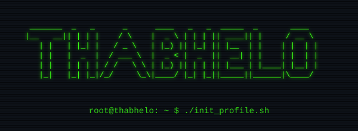

  

   

  <code>I sleep | sing | code | run | read | write | repeat</code>

   
   

  <code>
    [ <a href="mailto:thabhelo@deepubuntu.com"><b>email :: thabhelo@deepubuntu.com</b></a> ]
    &nbsp;&nbsp;
    [ <a href="https://instagram.com/thabhelo_tabs"><b>instagram :: @thabhelo_tabs</b></a> ]
  </code>

 

  <h3><code>// ~ who </code></h3>
  <code>
    CS, Math & Physics 
    11x Hackathon Winner 
    ex-Software Engineering @ Amazon, ex-ML Engineering @ Analytical AI 
    I love Open Source
  </code>

 

  <h3><code>// SYSTEM_STATS</code></h3>
  

 

  <h3><code>// TECH_STACK</code></h3>

  <code>[LANGUAGES]</code>
   
  
  
  
  
  
  
  
   

  <code>[TOOLS]</code>
   
  
  
  
  
  
  

   

  <code>[OS]</code>
   
  
  

 
 

  <code>echo "Exiting..."</code>

